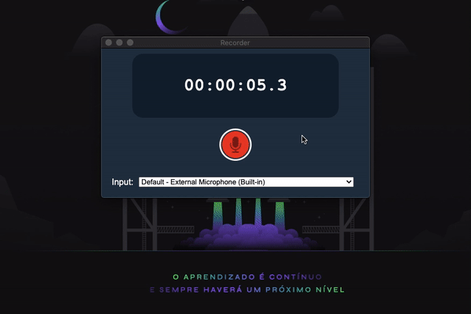
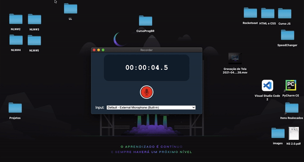
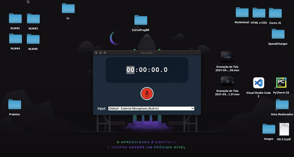

<h1 align="center">Recorder 🎙️</h1>

## 📸 Overview:

## 💻 Project:

O projeto foi desenvolvido no módulo de Electron do curso do programadorbr.

• A aplicação é um gravador de áudio. Você pode escolher onde quer salvar o arquivo depois de gravado e qual microfone de input usar.

• O App Desktop conta com uma barra de menu personalizada, em que temos acesso a uma janela de preferências, podendo mudar o diretório onde os áudios vão ficar salvos e também temos acesso direto ao mesmo.

## 🚀 Technologies:

I used the following technologies to develop this project:

#### ✔️ HTML
#### ✔️ CSS
#### ✔️ JavaScript
#### ✔️ Electron
